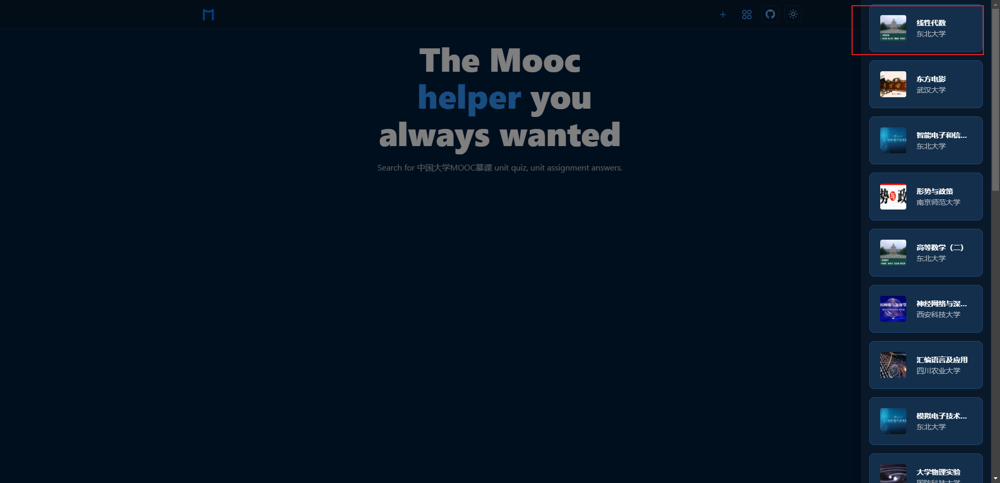
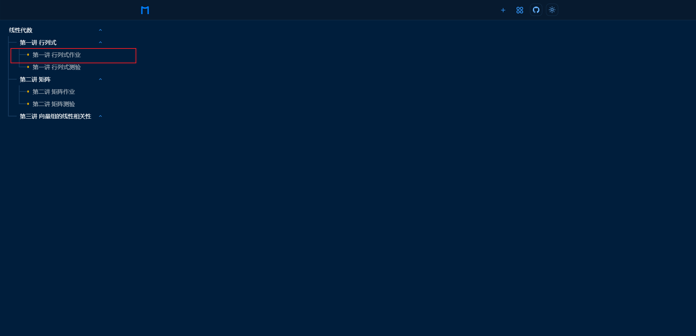
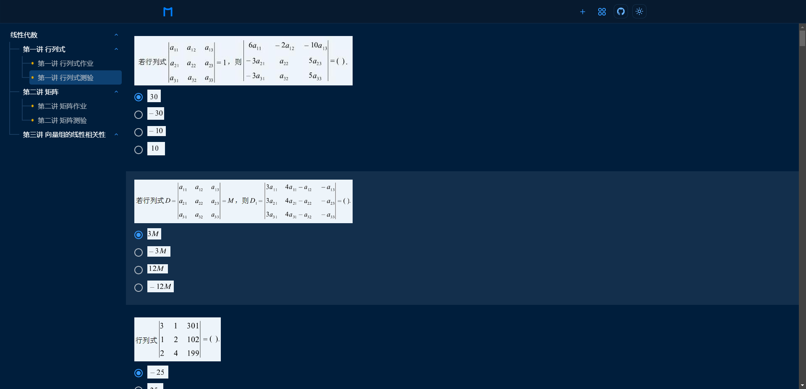
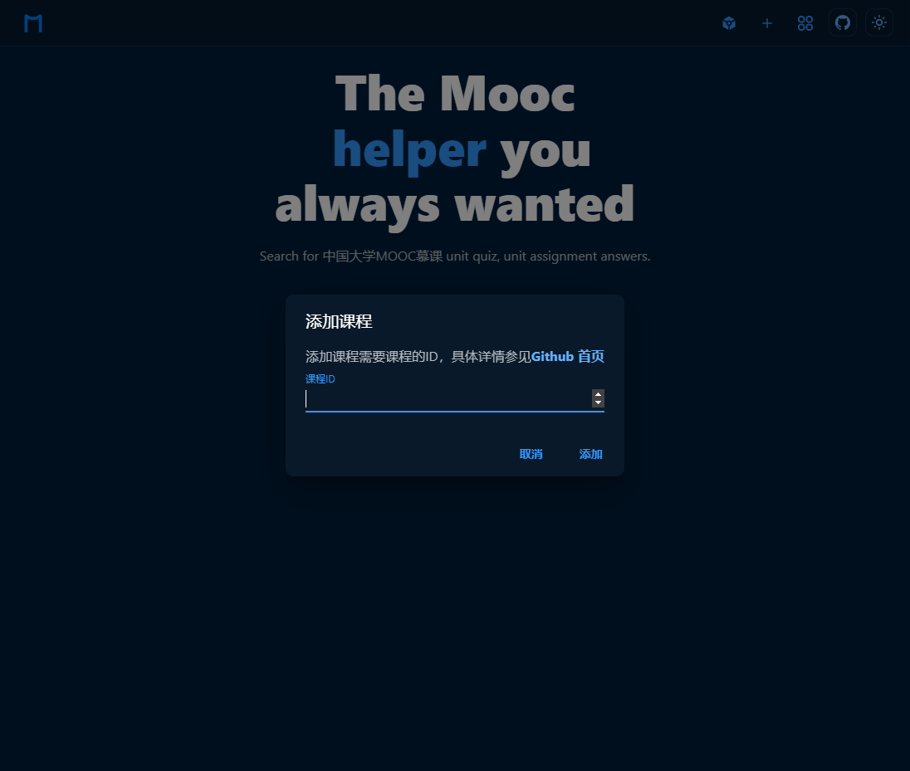
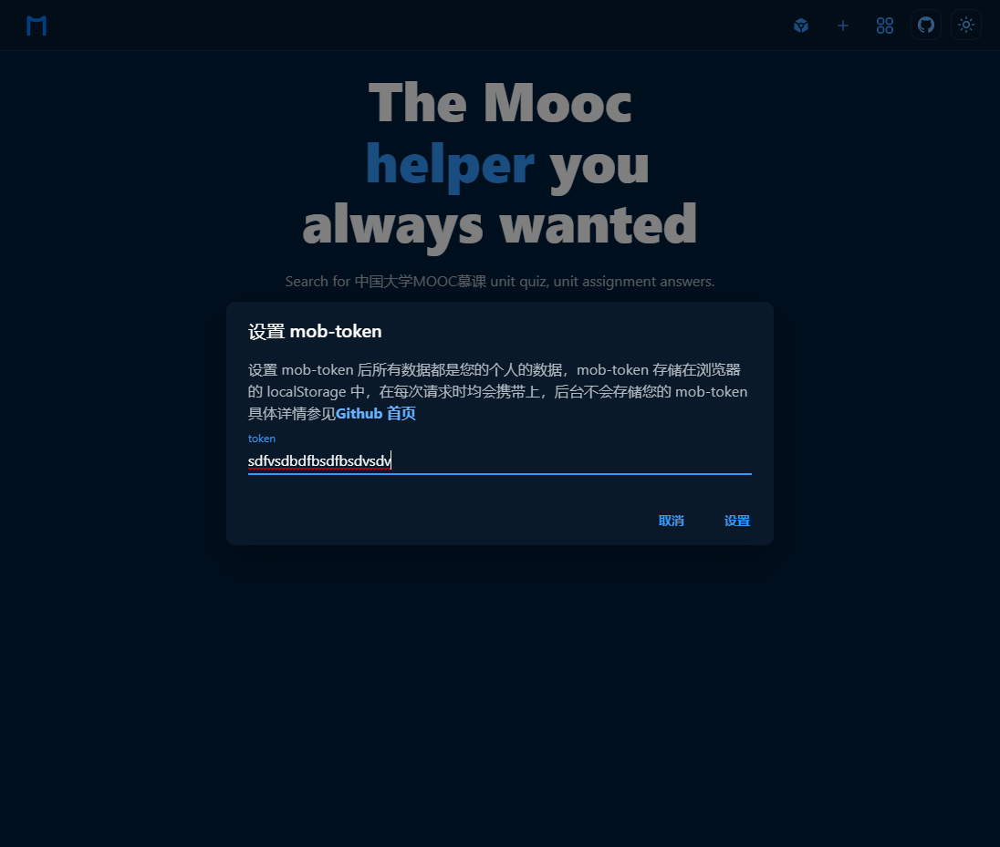

  

<h1 align="center">mooc helper</h1>

查询**中国大学MOOC慕课课程**的**单元测验**、**单元作业**的答案

## 静态网站地址

[mooc helper (cloudendpoint.cn)](https://mooc-helper.web.cloudendpoint.cn/)

## 用法

1. [添加课程](#addCourse)（如果待查询课程未添加）

> SPOC学校专属课程无法添加，除非你[设置 mob-token](#setMobToken)。(设置 mob-token 后，所有课程信息自动导入)

1. 选择对应课程

3. 选择章节

4. 点击查询

## 问题

### 1、如何添加课程?

添加课程需要课程的ID，这个ID就是`tid`字段对应的值

### 2、设置 mob-token

1. 如何获取 mob-token ？

你需要使用手机抓包工具，比如 [HttpCanary for Android - APK Download (apkpure.com)](https://apkpure.com/httpcanary-—-http-sniffer-capture-analysis/com.guoshi.httpcanary)

抓取 **中国大学MOOC** APP 的某些请求，比如 https://www.icourse163.org/mm-classroom/mob/j/v1/mocTermClassroomRpcBean.getStudentClassrooms.rpc 这些请求会携带 mob-token

2. 设置 mob-token

### 3、为什么我查不到参考答案？

- 原因一：你查找的课程未添加，需要先添加课程
- 其它未知原因

### 4、注意事项

- 题目排列顺序、答案排列顺序可能存在差异
