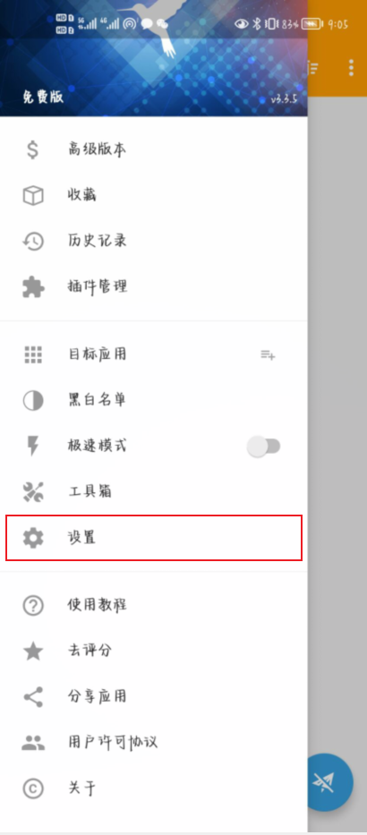
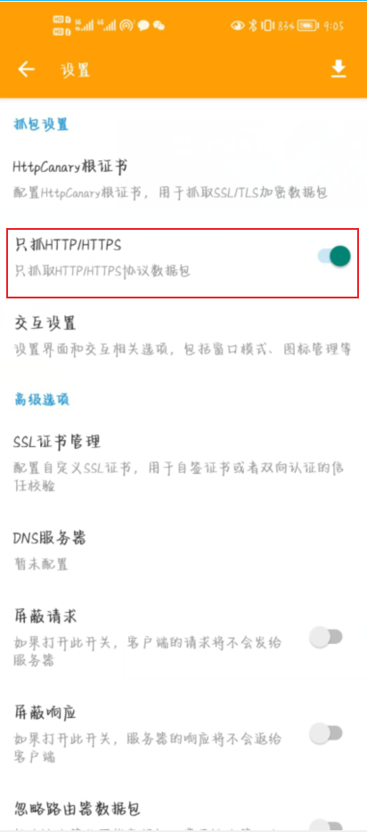
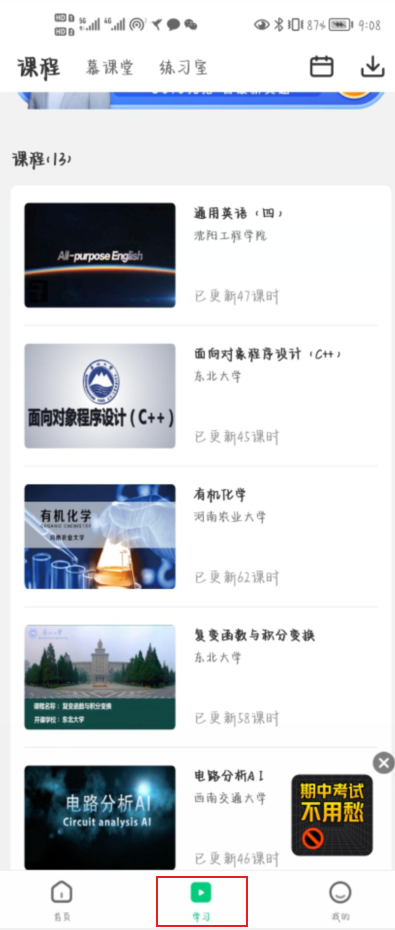
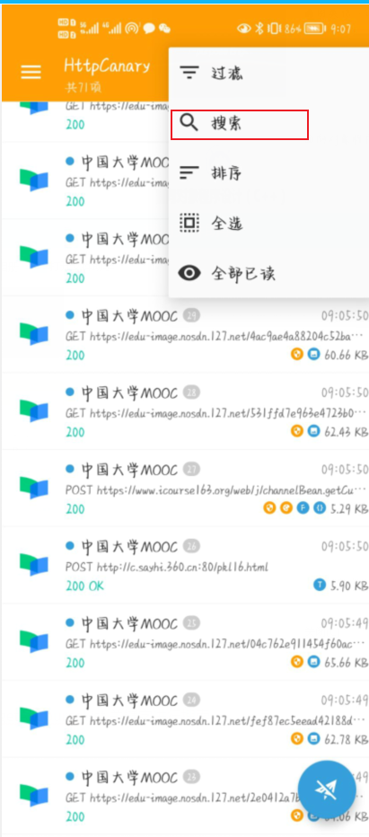
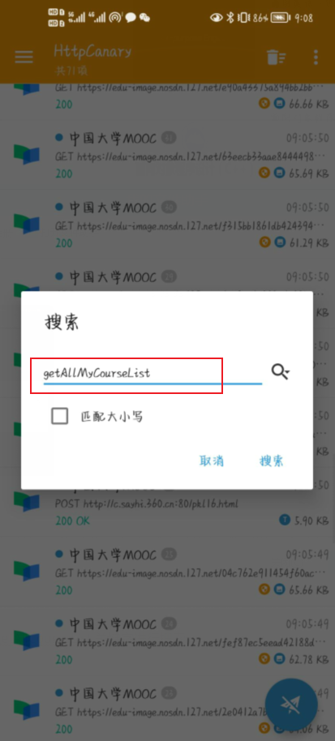

  

<h1 align="center">mooc helper</h1>

查询**中国大学MOOC慕课课程**的**单元测验**、**单元作业**的答案

## 静态网站地址

[mooc helper](https://mooc-helper.web.cloudendpoint.cn/)

## 用法

### 前置条件

查询前需要 [添加课程](#addCourse) 或 [设置mob-token](#setMobToken)

> SPOC学校专有课程无法添加，除非设置mob-token。设置mob-token后，课程信息自动导入，不再需要添加课程

### 选择对应课程

### 选择章节

### 点击查询

## 问题

### 1、如何添加课程?

添加课程需要课程的ID，这个ID就是`tid`字段对应的值

### 2、设置 mob-token

#### 1、获取 mob-token

##### 步骤一

在手机上安装抓包软件，比如 [HttpCanary for Android - APK Download (apkpure.com)](https://apkpure.com/httpcanary-—-http-sniffer-capture-analysis/com.guoshi.httpcanary)

##### 步骤二

打开抓包软件，这里以 HttpCanary 为例

打开设置界面

##### 步骤三

开启 只抓取 http/https

##### 步骤四

将 中国大学MOOC慕课 APP 添加进目标应用，点击开始抓包

##### 步骤五

打开 中国大学MOOC慕课 APP，切换至 学习 模块

##### 步骤六

回到 HttpCanary 应用界面，对 getAllMyCourseList 关键字进行搜索

##### 步骤七

选取任意一条记录，进入查看，选择 请求 选项卡，再选择 预览，然后我们就得到了 mob-token

#### 2、设置 mob-token

### 3、为什么我查不到参考答案？

- 原因一：你查找的课程未添加，需要先添加课程
- 其它未知原因

### 4、注意事项

- 题目排列顺序、答案排列顺序可能存在差异
